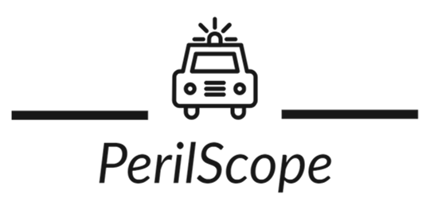
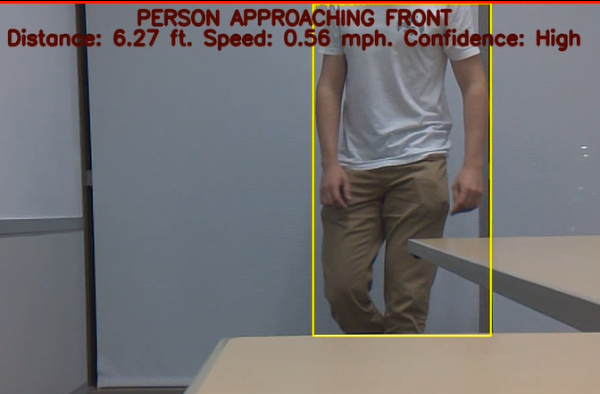

  

# PerilScope
This is the source code for PerilScope, a monitoring system for police vehicles that sends smart alerts for objects and events detected around the vehicle. This placed 1st overall at Aggies Invent: First Responders, the premier 48-hour design contest at Texas A&M open to all undergraduates and grad students.

## Performance
Image detection is accurate at a distance of 100 feet, and distance metrics are accurate to 40 feet. Predictions occur over 4 times per second, leading to a response time of .189 seconds for an approaching object. An example of an alert sent to the officer is shown below. Some examples of alerts programmed to work are: "armed person approaching front," "person in vehicle retreating to the left," and "armed person on bicycle approaching from the right."

  

# Approach
This project runs on a Jetson Nano with an attached camera and lidar sensor. It runs the lightweight Yolo v5 model to locate and classify images from the camera sensor, and it uses the lidar sensor to measure the object's distance and velocity relative to the vehicle. With this information, my program determines whether the objects and their distance/velocity pose a threat to an officer. If so, it sends a descriptive alert of the situation to the police officer. There are two levels of alert: low alert for non-threatening situations such as a slow-moving person, and high alert for potentially dangerous cases, including fast-moving people, armed people, or a vehicle quickly approaching. For high-alert situations, the display flashes the alert and will eventually send an audio cue to the officer.

# Credit
This project utilizes code from https://github.com/amirhosseinh77/JetsonYolo to set up the Yolo model and interact with the Jetson Nano camera. Everything else was written by me.

# Disclaimer
This entire project was done in the span of 48 hours, so best code practices were not always followed. It was still a very fun project to be a part of!
